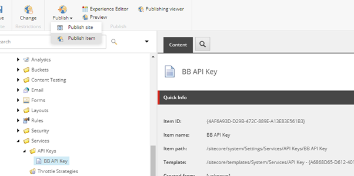
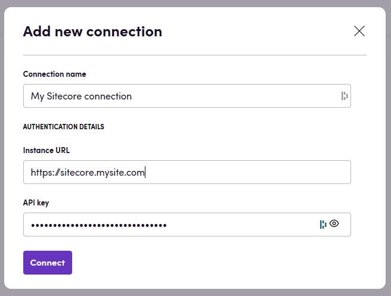

# Blackbird.io Sitecore

Blackbird is the new automation backbone for the language technology industry. Blackbird provides enterprise-scale automation and orchestration with a simple no-code/low-code platform. Blackbird enables ambitious organizations to identify, vet and automate as many processes as possible. Not just localization workflows, but any business and IT process. This repository represents an application that is deployable on Blackbird and usable inside the workflow editor.

## Introduction

<!-- begin docs -->

Sitecore is one of the leading enterprise-level content management systems, enabling web content editors and marketers to have full control over all aspects of their website from social integration and blog posts to advanced personalisation, ecommerce and more. This app focusses on the integration between Sitecore items, languages and the rest of the Blackbird ecosystem. Contrary to other Blackbird apps, in order to get up and running you need to install a custom-built plugin on your Sitecore instance.

## Before setting up

Before you can connect you need to make sure that:

- You have access to an instance of Sitecore.
- You have sufficient administrator access in Sitecore to install a plugin.
- You have received the Sitecore plugin package from Blackbird.

## Installing the plugin

1. Navigate to the installation wizzard.

2. Upload the plugin package you received from Blackbird.

3. Click _Next_.
4. Click _Install_.
5. Click _Close_.

## Creating an API key

1. Go to _Content Editor_.
2. Navigate to _System -> Settings -> Services -> API Keys_.
3. Insert a new API Key item.

4. Populate the following fields:
   - Allowed controllers: set to _\*_ or choose controllers.
   - Impersonation User: the request will be executed as this user. Sitecore admin can create users with some limitations if needed. Anonymous users will be impersonated as this user if the field value is empty.
5. Publish the item.

6. Copy the Item ID (including the parentheses) - this is your key and can be used in the next steps.

## Connecting

1. Navigate to apps and search for Sitecore. If you cannot find Sitecore then click _Add App_ in the top right corner, select Sitecore and add the app to your Blackbird environment.
2. Click _Add Connection_.
3. Name your connection for future reference e.g. 'My Sitecore connection'.
4. Fill in the URL to your Sitecore instance
5. Fill in the API key from the previous section.
6. Click _Connect_.

## Actions

- **Search items** finds items based on your search criteria, including last updated, created, language, path, etc.
- **Get all configured languages** returns all the languages that are configured in this Sitecore instance.
- **Get item content as HTML** get the content of an item represented as an HTML file so that it can be processed by NMT or TMS. You can specify which version/language should be retrieved.
- **Update item content from HTML** updates the content of a specific version/language. Additionally, you can choose to always create a new version.
- **Delete item content** deletes an item.

## Feedback

Do you want to use this app or do you have feedback on our implementation? Reach out to us using the [established channels](https://www.blackbird.io/) or create an issue.

<!-- end docs -->
