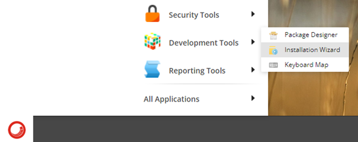
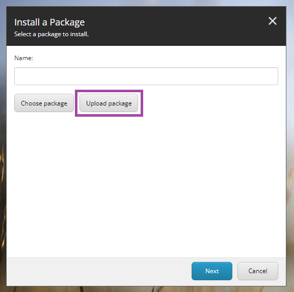
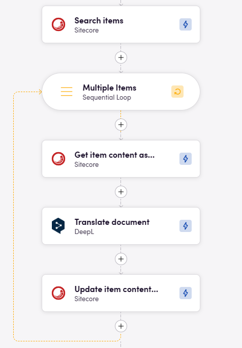

# Blackbird.io Sitecore XP

Blackbird is the new automation backbone for the language technology industry. Blackbird provides enterprise-scale automation and orchestration with a simple no-code/low-code platform. Blackbird enables ambitious organizations to identify, vet and automate as many processes as possible. Not just localization workflows, but any business and IT process. This repository represents an application that is deployable on Blackbird and usable inside the workflow editor.

## Introduction

<!-- begin docs -->

Sitecore is one of the leading enterprise-level content management systems, enabling web content editors and marketers to have full control over all aspects of their website from social integration and blog posts to advanced personalisation, ecommerce and more. This app focusses on the integration between Sitecore items, languages and the rest of the Blackbird ecosystem. Contrary to other Blackbird apps, in order to get up and running you need to install a custom-built plugin on your Sitecore instance.

This app is built for Sitecore XP. For Sitecore XM Cloud see [this guide](https://docs.blackbird.io/apps/sitecore-xm-cloud/) instead.

## Before setting up

Before you can connect you need to make sure that:

- You have access to an instance of Sitecore XP.
- You have sufficient administrator access in Sitecore to install a plugin.
- You have downloaded the latest Blackbird Sitecore plugin package from [here](https://docs.blackbird.io/sitecore/package.zip).

## Installing the plugin

1. On the 'Desktop' Navigate to the installation wizzard.

2. Upload the plugin package you received from Blackbird.

3. Click _Next_.
4. Click _Install_.
5. Click _Close_.

## Creating an API key

1. Go to _Content Editor_.
2. Navigate to _System -> Settings -> Services -> API Keys_.
3. Insert a new API Key item.

4. Populate the following fields:
   - Allowed controllers: set to _\*_ or choose controllers.
   - Impersonation User: the request will be executed as this user. Sitecore admin can create users with some limitations if needed. Anonymous users will be impersonated as this user if the field value is empty or wrong. Make sure you input this value as sitecore\username.
5. Publish the item.

6. Copy the Item ID (including the parentheses) - this is your key and can be used in the next steps.

## Connecting

1. Navigate to apps and search for Sitecore XP.
2. Click _Add Connection_.
3. Name your connection for future reference e.g. 'My Sitecore connection'.
4. Fill in the URL to your Sitecore instance
5. Fill in the API key from the previous section.
6. Click _Connect_.

## Actions

- **Search items** Finds items based on specified search criteria such as last updated date, creation date, language, path, and more. You can narrow down results with various filters to locate exactly what you need. Note that 'Workflow' and 'Current workflow state' values will only be populated when you provide the optional 'Workflow state ID' input parameter - otherwise these fields will return null. The optional parameter 'Include all subitems' controls the search depth: when set to true (default), the search includes all descendant items under the root path; when set to false, only direct children of the root path are included.
- **Get workflow state** Get workflow state of an item. This action retrieves the workflow state of a specific item, which is useful for understanding the current status of the item in the workflow process.
- **Get all configured languages** returns all the languages that are configured in this Sitecore instance.
- **Get item content as HTML** get the content of an item represented as an HTML file so that it can be processed by NMT or TMS. You can specify which version/language should be retrieved.
- **Update item content from HTML** updates the content of a specific version/language. Additionally, you can choose to always create a new version.
- **Delete item content** deletes an item.
- **Get Item ID from HTML** retrieves the item ID from the HTML content. When you receive translated HTML content we will add the Item ID to the header of HTML file, this action allows you to receive the Item ID from the HTML document.
- **Search workflows** searches for workflows in Sitecore. This action is more about debugging and understanding the workflows that are available in your Sitecore instance. Typically you won't use this action in real world scenarios.
- **Update workflow state** updates the state of a workflow for a specific item.

## Events

- **On items created** Polls for items that have been created since the last poll.
- **On items updated** Polls for items that have been updated since the last poll. 
- **On items assigned to workflow state** Polls for items that currently have a specific workflow state. This event returns all items with the specified workflow state, regardless of whether they appeared in previous polls. To avoid processing the same items repeatedly, use the **Update workflow state** action after processing each item. For example, you might poll for items in the "Ready for localization" state, process them, and then update their workflow state to "In translation" or "Translation completed".

> Important: The events are not real-time, they are polling events. You can set the polling interval through the UI. The default is 1 hour, minimal is 5 minutes.

## Example

This example shows how one could retrieve a subset of items, based on custom criteria, download these items HTML files, translate them using any NMT provider and update the translations.

## Feedback

Do you want to use this app or do you have feedback on our implementation? Reach out to us using the [established channels](https://www.blackbird.io/) or create an issue.

<!-- end docs -->
